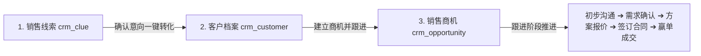

# 🎓 Java 初学者专属 - CRM 后台管理系统标准流程与源码详细讲解文档

> **专为 Java 初学者打造！** 本文档从零开始讲解这套基于 **Spring Boot 3 + MyBatis-Plus + Spring Security + JWT** 搭建的标准 CRM（客户关系管理）后台项目的架构原理、数据库设计、权限机制与标准业务流转流程。

---

## 📚 目录

1. [项目架构与核心技术选型](#1-项目架构与核心技术选型)
2. [标准 CRM 商业全流程图解](#2-标准-crm-商业全流程图解)
3. [RBAC 权限管理与 JWT 认证原理](#3-rbac-权限管理与-jwt-认证原理)
4. [数据库表结构与设计详解](#4-数据库表结构与设计详解)
5. [Java 核心代码层级与包结构分析](#5-java-核心代码层级与包结构分析)
6. [初学者动手指南：项目启动与接口测试](#6-初学者动手指南项目启动与接口测试)
7. [新手二次开发指引：如何新增一个功能](#7-新手二次开发指引如何新增一个功能)

---

## 1. 项目架构与核心技术选型

作为 Java 初学者，首先需要明白企业级 Web 项目的标准三层架构（MVC 模式）：

```
[前端客户端 (Postman / Vue)] 
         │ (HTTP RESTful 请求 + JWT Token Header)
         ▼
[Controller 控制层] ──> 负责接收请求、校验参数、调用 Service，返回统一格式数据 Result<T>
         │
         ▼
[Service 业务逻辑层] ──> 编写具体业务代码（如：线索转化为客户、密码加密校验、分配角色等）
         │
         ▼
[Mapper 持久化层]   ──> MyBatis-Plus 自动将 Java 对象 (DO) 转化为 SQL 语句操作数据库 (MySQL)
         │
         ▼
[MySQL 8.0 数据库]
```

### 核心技术栈：
- **Spring Boot 3.2.2**：当前最新的 Java 主流脚手架框架，帮助我们自动装配组件。
- **Spring Security 6**：Java 最强大的安全框架，负责拦截未登录请求与校验角色/按钮权限。
- **JWT (JSON Web Token)**：无状态分布式 Token 认证。用户登录成功后获得 Token，后续请求在 Header 携带 Token。
- **MyBatis-Plus 3.5.5**：ORM 数据库操作增强工具，免去手写大部分 CRUD SQL。
- **Knife4j (Swagger 3)**：自动生成图形化 API 接口调试文档。

---

## 2. 标准 CRM 商业全流程图解

标准的 CRM 销售管理流程遵循**销售漏斗模型**，核心流程包含三大阶段：



### 核心业务概念解释：
1. **销售线索 (Clue)**：最初接触到的潜在客户信息（如展会收集的名片、官网在线咨询的电话）。
2. **客户档案 (Customer)**：经过初步沟通确定有购买意向的正式客户信息。
   - **客户公海池 (Public Pool)**：长时间未跟进或无专人负责的客户放入公海，供其他销售人员公开领取。
3. **销售商机 (Opportunity)**：针对某个客户正在推进的具体销售项目（如“阿里云服务采购项目 50 万元”），包含具体的金额和销售阶段。

---

## 3. RBAC 权限管理与 JWT 认证原理

### 3.1 什么是 RBAC 权限模型？
**RBAC（Role-Based Access Control）** 是最经典的基于角色的权限访问控制模型：
- **用户 (User)** 👈绑定👉 **角色 (Role)** 👈绑定👉 **权限/菜单 (Permission)**

#### 例子：
- 用户 `admin` 绑定了角色 `超级管理员` ➔ 拥有一切权限 (`*:*:*`)。
- 用户 `seller` 绑定了角色 `普通销售` ➔ 拥有 `crm:customer:query`（查看客户）、`crm:customer:add`（新增客户），但无 `sys:user:delete`（删除用户）权限。

### 3.2 JWT 登录认证流程
1. **用户登录**：客户端发送 `POST /api/auth/login`（包含 username, password）。
2. **密码校验**：后端使用 `BCryptPasswordEncoder` 校验密文是否匹配。
3. **生成 Token**：校验成功后，`JwtUtils` 使用秘钥生成字符串 `token` 返回给前端。
4. **携带 Token 请求**：前端在后续每次请求 Header 中传入 `Authorization: Bearer <token>`。
5. **拦截器校验**：[`JwtAuthenticationFilter`](file:///d:/javaProject/javaTest/src/main/java/com/zqw/crm/security/JwtAuthenticationFilter.java) 解析 Token 并在 Spring Security 上下文中保存当前用户身份。

---

## 4. 数据库表结构与设计详解

初始化 SQL 文件在：[`sql/crm_init.sql`](file:///d:/javaProject/javaTest/sql/crm_init.sql)

### 核心数据表对照：

| 表名 | 功能 | 核心字段说明 |
| :--- | :--- | :--- |
| `sys_user` | 系统用户表 | `id`, `username`, `password`(BCrypt密文), `real_name`, `status` |
| `sys_role` | 系统角色表 | `id`, `role_name`, `role_key`(如 `ROLE_SALES`) |
| `sys_permission` | 权限/菜单表 | `id`, `parent_id`, `name`, `perm_key`(如 `crm:customer:add`) |
| `sys_user_role` | 用户-角色关联表 | `user_id`, `role_id` (多对多) |
| `sys_role_permission` | 角色-权限关联表 | `role_id`, `permission_id` (多对多) |
| `crm_customer` | 客户档案表 | `id`, `name`, `phone`, `company`, `level`, `status`, `owner_id` |
| `crm_clue` | 销售线索表 | `id`, `name`, `phone`, `source`, `status`(未处理/已转化) |
| `crm_opportunity` | 销售商机表 | `id`, `customer_id`, `name`, `amount`, `stage` |

---

## 5. Java 核心代码层级与包结构分析

源码位于目录：[`src/main/java/com/zqw/crm`](file:///d:/javaProject/javaTest/src/main/java/com/zqw/crm)

```
com.zqw.crm
├── CrmApplication.java                 # 启动类主入口
├── common                              # 通用公共包
│   ├── Result.java                     # 统一 REST 返回对象 (code, msg, data)
│   ├── PageResult.java                 # 统一分页数据返回对象 (list, total)
│   ├── BizException.java               # 自定义业务异常
│   ├── GlobalExceptionHandler.java     # 全局异常捕获处理器
│   └── JwtUtils.java                   # JWT Token 生成与解析工具
├── security                            # 安全与鉴权配置
│   ├── SecurityConfig.java             # Spring Security 过滤链配置
│   ├── JwtAuthenticationFilter.java    # JWT 请求拦截校验过滤器
│   ├── UserDetailsServiceImpl.java     # 从数据库加载用户角色与权限
│   └── SecurityUser.java               # Spring Security 框架需要的 UserDetails 实现
├── entity                              # 数据库实体类 (与 MySQL 表 1-1 对应)
│   ├── SysUser.java / SysRole.java / SysPermission.java
│   └── CrmCustomer.java / CrmClue.java / CrmOpportunity.java
├── mapper                              # MyBatis-Plus Mapper 接口 (数据持久层)
│   ├── SysUserMapper.java / CrmCustomerMapper.java ...
├── service                             # 业务逻辑接口层
│   └── service/impl                    # 业务逻辑具体实现类
└── controller                          # RESTful HTTP 控制层接口 (API 入口)
    ├── AuthController.java             # 登录/退出/个人信息
    ├── UserController.java             # 用户管理与角色分配
    ├── RoleController.java             # 角色管理与权限分配
    ├── CustomerController.java         # 客户增删改查 CRUD
    ├── ClueController.java             # 线索管理与线索转客户
    └── OpportunityController.java     # 商机管理与阶段推进
```

---

## 6. 初学者动手指南：项目启动与接口测试

### 第一步：准备 MySQL 数据库
1. 确保已安装 MySQL 8.0+。
2. 在 MySQL 中创建数据库：`CREATE DATABASE crm_db DEFAULT CHARACTER SET utf8mb4;`
3. 执行工作区中的初始化 SQL 脚本：[`sql/crm_init.sql`](file:///d:/javaProject/javaTest/sql/crm_init.sql)

### 第二步：修改项目数据库配置
打开 [`src/main/resources/application.yml`](file:///d:/javaProject/javaTest/src/main/resources/application.yml)，将数据库账号和密码修改为你本地的 MySQL 密码：
```yaml
spring:
  datasource:
    url: jdbc:mysql://localhost:3306/crm_db?useSSL=false&serverTimezone=Asia/Shanghai
    username: root
    password: your_local_mysql_password
```

### 第三步：运行项目
在 IDEA 或终端运行 [`CrmApplication.java`](file:///d:/javaProject/javaTest/src/main/java/com/zqw/crm/CrmApplication.java)。

### 第四步：使用 Swagger / Knife4j 进行可视化接口测试
1. 启动成功后，在浏览器打开：`http://localhost:8080/doc.html`
2. **测试登录**：
   - 打开 **01. 认证接口** ➔ `POST /api/auth/login`。
   - 输入参数：
     ```json
     {
       "username": "admin",
       "password": "123456"
     }
     ```
   - 点击发送，获取返回的 `token` 字符串。
3. **设置请求头 Authorization**：
   - 在 Knife4j 左上角“文档管理”/“全局参数设置”中添加 Header：
     `Authorization: Bearer <刚才复制的token>`
4. **测试客户管理 CRUD**：
   - 打开 **05. 客户管理接口 (CRUD)** ➔ `GET /api/crm/customer/page` 进行测试！

---

## 7. 新手二次开发指引：如何新增一个功能

作为初学者，假设你现在想新增一个功能（例如：**增加客户跟进记录 `crm_follow_record`**），请遵循以下标准 5 步走流程：

1. **第 1 步 (SQL)**：在 MySQL 中建表 `crm_follow_record`。
2. **第 2 步 (Entity)**：在 `entity` 包创建 `CrmFollowRecord.java`，加上 `@TableName("crm_follow_record")`。
3. **第 3 步 (Mapper)**：在 `mapper` 包创建 `CrmFollowRecordMapper.java`，继承 `BaseMapper<CrmFollowRecord>`。
4. **第 4 步 (Service)**：创建 `CrmFollowRecordService.java` 及实现类 `CrmFollowRecordServiceImpl.java`。
5. **第 5 步 (Controller)**：在 `controller` 包创建 `FollowRecordController.java` 暴露 REST 接口，并加注解 `@PreAuthorize("hasAuthority('crm:customer:query')")` 进行鉴权。

祝你 Java 学习愉快！有任何疑问随时与我交流！
