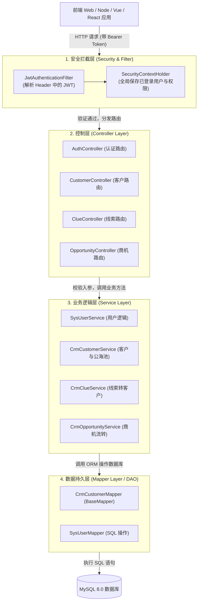
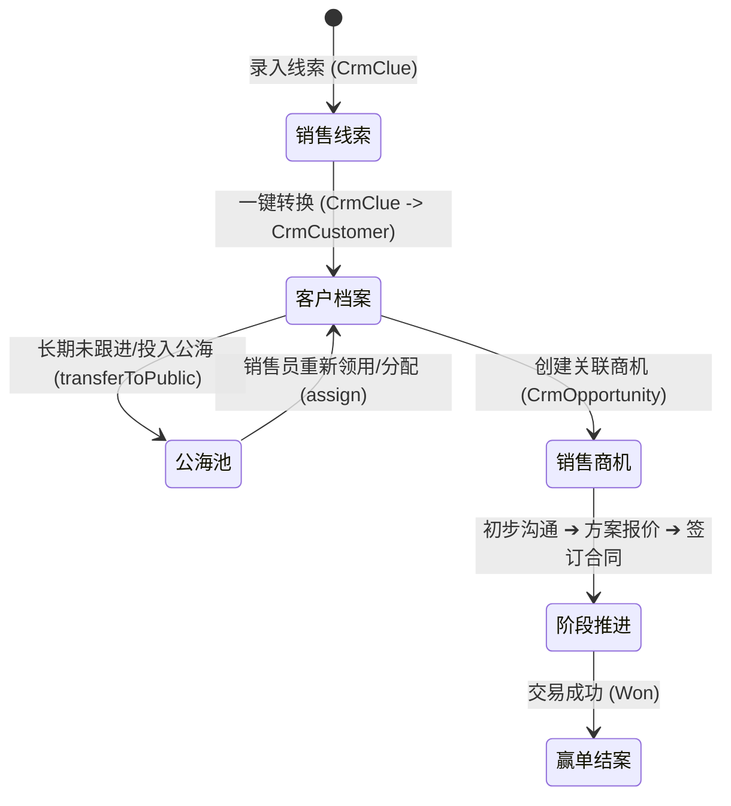

# CRM 后端项目架构与模块详解 (面向前端开发者的 Java 架构指南)

**项目名称**：CRM 后端管理系统 (`crm-backend`)  
**技术栈**：Java 17 + Spring Boot 3.2 + MyBatis-Plus 3.5 + Spring Security 6 + JWT + Knife4j  
**文档生成时间**：2026-08-12  

---

## 目录

1. [项目整体架构图与分层设计](#1-项目整体架构图与分层设计)
2. [前端技术栈 🆚 Java 后端技术栈概念对照表](#2-前端技术栈--java-后端技术栈概念对照表)
3. [核心模块与包结构详细介绍](#3-核心模块与包结构详细介绍)
   - [controller（控制层 / 路由处理器）](#1-controller控制层--路由处理器)
   - [service（业务逻辑层）](#2-service业务逻辑层)
   - [mapper（持久层 / DAO）](#3-mapper持久层--dao)
   - [entity & vo（数据模型与传输对象）](#4-entity--vo数据模型与传输对象)
   - [security（安全认证与授权）](#5-security安全认证与授权)
   - [common（公共通用组件）](#6-common公共通用组件)
4. [全流程请求处理生命周期（Request Lifecycle）](#4-全流程请求处理生命周期request-lifecycle)
5. [核心商业业务闭环（线索 ➜ 客户 ➜ 商机）](#5-核心商业业务闭环线索--客户--商机)

---

## 1. 项目整体架构图与分层设计

本系统采用 Java 企业级开发中最经典的 **MVC 经典分层架构**，同时外层叠加了 **Spring Security 安全过滤器链**，实现了低耦合、高内聚的模块划分。



---

## 2. 前端技术栈 🆚 Java 后端技术栈概念对照表

为了帮助有前端背景的小白开发者迅速建立对 Java 后端架构的直观理解，以下为**前后端核心概念对照映射表**：

| 前端 (Node.js / Express / TS / React) 概念 | Spring Boot / Java 后端对应概念 | 对应本项目的包/文件 | 核心职责说明 |
|---|---|---|---|
| **`Express/Koa Router`** (路由监听与函数) | **`Controller` 控制层** (`@RestController`) | `com.zqw.crm.controller` | 监听 HTTP 请求，定义 API 路由，校验参数并返回 JSON。 |
| **`TypeScript Interface / Zod DTO`** | **`VO (View Object)` / `Req/Resp`** | `com.zqw.crm.vo` | 定义前端输入的 JSON 格式及后端响应的字段结构。 |
| **`Prisma / TypeORM / Mongoose Model`** | **`Entity` 实体类** (`@TableName`) | `com.zqw.crm.entity` | 1 对 1 映射 MySQL 数据库中表的字段结构。 |
| **`Prisma Client 方法 (findMany/create)`** | **`Mapper` 持久层接口** (`BaseMapper<T>`) | `com.zqw.crm.mapper` | 执行增删改查 SQL，MyBatis-Plus 自动提供了单表 CRUD 方法。 |
| **`Express Middleware` 中间件** | **`Filter` 过滤器 / `Interceptor`** | `com.zqw.crm.security` | 在请求到达路由前，拦截校验 JWT Token 的合法性。 |
| **`app.use((err, req, res, next) => ...)`** | **`GlobalExceptionHandler` 全局异常捕获** | `com.zqw.crm.common` | 统一拦截未捕获的 Exception，返回优雅的 JSON 错误信息。 |
| **`package.json` + `npm install`** | **`pom.xml` + `Maven (mvn)`** | `pom.xml` | 声明项目的外部依赖库（Jar 包）和打包配置。 |

---

## 3. 核心模块与包结构详细介绍

### 1. `controller`（控制层 / 路由处理器）
* **包路径**：`com.zqw.crm.controller`
* **前端类比**：Express / NestJS 中的 Controller 路由模块。
* **主要职责**：
  - 暴露 RESTful 接口（使用 `@GetMapping`, `@PostMapping`, `@PutMapping`, `@DeleteMapping`）；
  - 使用 `@Valid` 自动触发输入参数校验；
  - 调用 `Service` 层方法执行逻辑，最后使用 `Result.success()` 封装统一格式返回给前端。
* **核心类**：
  - [AuthController.java](file:///d:/javaProject/javaTest/src/main/java/com/zqw/crm/controller/AuthController.java)：处理登录、退出、获取个人信息；
  - [CustomerController.java](file:///d:/javaProject/javaTest/src/main/java/com/zqw/crm/controller/CustomerController.java)：客户档案 CRUD、公海池划转、负责人分配；
  - [ClueController.java](file:///d:/javaProject/javaTest/src/main/java/com/zqw/crm/controller/ClueController.java)：销售线索管理与一键转客户；
  - [OpportunityController.java](file:///d:/javaProject/javaTest/src/main/java/com/zqw/crm/controller/OpportunityController.java)：商机阶段流转。

---

### 2. `service`（业务逻辑层）
* **包路径**：`com.zqw.crm.service`（接口）及 `com.zqw.crm.service.impl`（实现类）
* **前端类比**：前端项目中的 Service / Store 业务逻辑计算模块。
* **主要职责**：
  - 存放所有的核心商业逻辑（如：计算线索转客户时的状态变更、校验密码是否正确、分配角色与权限逻辑）；
  - 保证事务一致性（使用 `@Transactional`，若中途失败自动回滚数据库）。

---

### 3. `mapper`（持久层 / DAO）
* **包路径**：`com.zqw.crm.mapper`
* **前端类比**：Prisma / TypeORM / Sequelize 的 DB Client 方法集合。
* **主要职责**：
  - 直接与 MySQL 数据库交互；
  - 继承了 MyBatis-Plus 的 `BaseMapper<T>` 接口，无需手写 SQL 即可免费获得 `insert`、`deleteById`、`updateById`、`selectPage` 等常用增删改查方法。

---

### 4. `entity` & `vo`（数据模型与传输对象）
* **包路径**：`com.zqw.crm.entity`（数据库表实体）与 `com.zqw.crm.vo`（视图传输对象）
* **前端类比**：TypeScript 中的类型定义（Interfaces）。
* **设计意图（为什么要分开）**：
  - **`Entity`**：严格与数据库表一模一样（如 `sys_user` 表对应 `SysUser.java`），包含敏感字段（如密码哈希 `password`）。
  - **`VO`**：专门用于 API 传输。比如前端登录时只需传 `LoginReq(username, password)`，登录成功后端返回 `LoginResp(token, username, roles)`，屏蔽敏感数据，提升安全性。

---

### 5. `security`（安全认证与授权）
* **包路径**：`com.zqw.crm.security`
* **前端类比**：路由守卫 (Route Guard) + JWT 鉴权中间件。
* **核心组件**：
  - **`SecurityConfig.java`**：Spring Security 主配置文件，配置哪些接口允许匿名访问（如 `/api/auth/login` 和 `/doc.html`），哪些接口必须登录；
  - **`JwtAuthenticationFilter.java`**：全局请求过滤器。每次请求进来时，读取 Header 中的 `Authorization: Bearer <token>`，校验 JWT 合法性并提取当前登录用户；
  - **`SecurityUser.java`**：实现 Spring Security 的 `UserDetails` 接口，在内存中保存当前用户的账户、密码及拥有的角色权限列表。

---

### 6. `common`（公共通用组件）
* **包路径**：`com.zqw.crm.common`
* **核心组件**：
  - [Result.java](file:///d:/javaProject/javaTest/src/main/java/com/zqw/crm/common/Result.java)：统一 JSON 响应封装对象；
  - [PageResult.java](file:///d:/javaProject/javaTest/src/main/java/com/zqw/crm/common/PageResult.java)：统一分页响应结构（包含列表 `list` 和总条数 `total`）；
  - **`GlobalExceptionHandler.java`**：全局异常拦截器。捕获未预期的 Exception 并转为 `{ code: 500, msg: "系统繁忙" }`，防止服务端暴露敏感堆栈信息。

---

## 4. 全流程请求处理生命周期（Request Lifecycle）

当前端发送一个 `GET /api/crm/customer/page`（获取客户分页列表）请求时，后端的完整处理流转顺序如下：

```
1. 客户端发送 HTTP 请求 (Header 携带 JWT Token)
   │
   ▼
2. JwtAuthenticationFilter (过滤器)
   ├─ 解析 Header 中的 JWT Token
   ├─ 验证 Token 是否过期与签名合法性
   └─ 将用户信息写入 SecurityContext 上下文
   │
   ▼
3. CustomerController (控制层)
   ├─ 检查接口权限 (@PreAuthorize)
   ├─ 接收并校验入参 CustomerQueryReq
   └─ 调用 CrmCustomerService.queryPage(req)
   │
   ▼
4. CrmCustomerServiceImpl (业务逻辑层)
   ├─ 构造 MyBatis-Plus 分页对象与 LambdaQueryWrapper 条件构造器
   └─ 调用 CrmCustomerMapper.selectPage(...)
   │
   ▼
5. CrmCustomerMapper (持久层)
   └─ 执行 SQL: SELECT * FROM crm_customer WHERE status=? LIMIT ?, ?
   │
   ▼
6. MySQL 数据库返回 ResultSet 结果集
   │
   ▼
7. Service 封装 List<CrmCustomer> 并返回给 Controller
   │
   ▼
8. Controller 使用 Result.success(PageResult) 转换为统一 JSON 结构
   │
   ▼
9. 返回 HTTP 200 JSON 字符串给前端客户端
```

---

## 5. 核心商业业务闭环（线索 ➜ 客户 ➜ 商机）

本项目包含标准 CRM 系统完整的商业生命周期：



---

### 📝 总结
本项目采用了业界标准的 Spring Boot 架构设计，层级职责分明，具备良好的扩展性与安全性。前端开发者在阅读与修改本项目时，只需按照 **`Controller` (定义接口) ➔ `Service` (写逻辑) ➔ `Mapper` (操作数据库)** 的固定套路即可快速上手开发！
